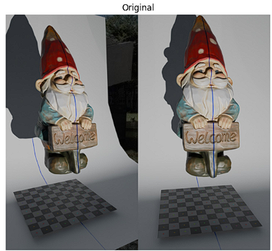
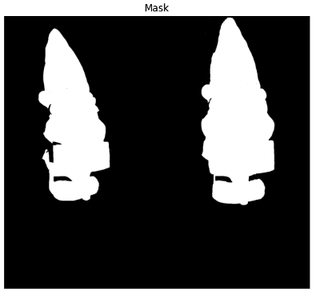
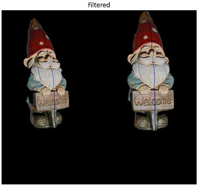
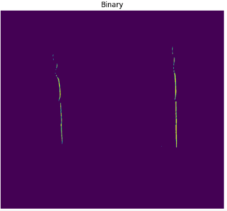
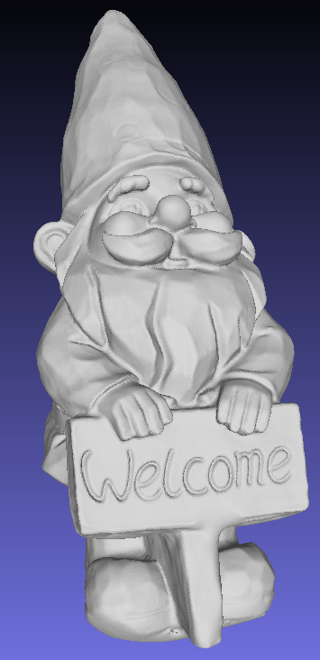
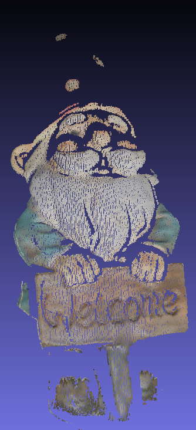
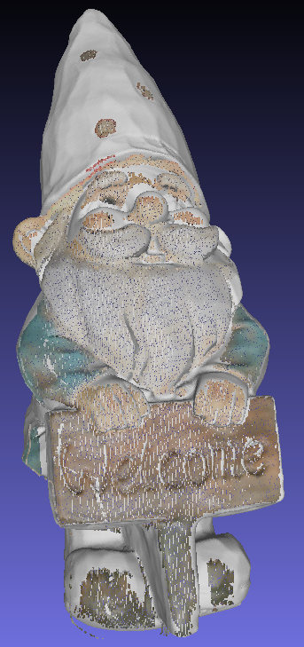
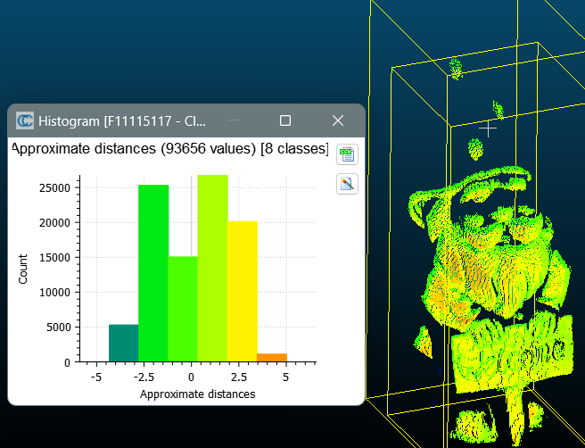

# Final Project — 3D Reconstruction from Stereoscopic Images

**Computer Vision and Applications (CI5336701) — NTUST, 2024 Spring** · David Medina Rosner · F11115117
[Project brief](FinalProject.pdf) · [Report](final_david_medina.pdf) · [Solution notebook](final_david_medina.ipynb)

---

## The task

**179 side-by-side frames** of 1440×1280 — two 720×1280 views of the same moment — follow a **blue laser line** sweeping down a garden gnome (the same statue as Homework 3, now photographed rather than scanned). Both cameras' `K` and `[R|t]` are given, along with the **fundamental matrix `F`**. Reconstruct a **colour** 3D point cloud by direct triangulation, reject outliers by their reprojection error, and benchmark against [`GroundTruth.stl`](GroundTruth.stl) (789,170 triangles).



---

## The theory — epipolar geometry and triangulation

The midterm reconstructed 3D from *one* camera by replacing the second view with a known plane. Here there really are **two cameras**, which opens the classic stereo route — and brings its one hard problem: **correspondence**. Given a pixel in the left image, which pixel in the right image is the same physical point? Checking every candidate is a 2D search over a million pixels, per point, per frame.
**The epipolar constraint collapses that search to one dimension.** A pixel `x` in the left view, together with the two camera centres, defines a plane in 3D. The matching point must lie where that plane cuts the right image — which is a **line**, not a region. The fundamental matrix turns this into one multiplication: `l' = Fx` gives the coefficients of that line directly. The 2D hunt becomes a walk along a single line, and `Fᵀ` runs the same argument backwards, right to left.

**Direct triangulation.** Once a pair is matched, the two projections `x = PX` and `x' = P'X` both hold. Clearing each perspective divide by cross-multiplication — the same manoeuvre as the DLT in Homeworks 2 and 3 — yields **two linear rows per view**, so a stereo pair gives a 4×4 homogeneous system `AX = 0`, solved once more by **SVD** on the smallest singular vector. That makes three assignments in a row where "write the non-linear projection as a homogeneous linear system and take the last column of `V`" is the answer. It also hands over the outlier test for free: two rays in 3D almost never meet exactly, and `‖AX‖` measures how badly they miss, so a wrong correspondence scores high. Thresholding it is precisely the "reject outliers by verifying their reprojection error" the brief asks for.

---

## The implementation

Background first: **GrabCut** segments the gnome out of frame `000` once, and because camera and statue never move, that single mask is reused for all 179 frames. Then the laser line is isolated by requiring blue to beat **both** other channels — `B−R > 20` **and** `B−G > 20`. The midterm could use a single channel difference because its scene was grey marble; here the scene is fully coloured, so one comparison is not enough to pin down hue.

| GrabCut mask | Masked frame | Blue line, isolated |
|---|---|---|
|  |  |  |

One pixel per row survives (the rightmost maximum), giving a clean 1-px curve per view. Both directions are then run — left→right with `F`, right→left with `Fᵀ` — and each point's colour is the **average of its two views**, so the cloud carries real colour rather than one camera's white balance:

```python
epipolar_line = F @ point                  # l' = Fx  — a LINE in the other view
for x in range(img_width):                 # walk it until a lit pixel is hit
    y = int((-epipolar_line[0]*x - epipolar_line[2]) / epipolar_line[1])
    if 0 <= y < img_height and binary_img[y, x]:
        break
A = np.array([ul*P_L3 - P_L1, vl*P_L3 - P_L2,      # 2 rows per view
              ur*P_R3 - P_R1, vr*P_R3 - P_R2])
u, s, vT = np.linalg.svd(A)
X = vT[3] / vT[3, 3]                       # smallest singular vector, normalised
if np.linalg.norm(A @ X) <= 150:           # residual = how badly the rays miss
    triangulated_point.append(X)
```

---

## The result

**93,656 points**, spanning 64 mm × 60 mm × 155 mm — a gnome about 200 mm tall, as the brief specifies. Against the ground-truth mesh, CloudCompare reports a **mean distance of 1.37 mm** (max 5.73 mm, σ 0.90 mm) across every one of those points, with the histogram tightly massed between ±2.5 mm.

| Ground truth — 789,170 faces | Reconstruction — 93,656 points | Cloud over the mesh |
|---|---|---|
|  |  |  |



**The hat is the one real hole, and it is a physics problem, not a bug.** A blue laser on a red surface reflects almost nothing — red pigment absorbs blue — so over the hat the line darkens to near-black and the `B−R > 20` test finds nothing. It shows up twice above: as the break in the isolated blue line, and as the bare white cone in the overlay where the mesh shows through an empty cloud. **Other honest limitations:** the 150 threshold is in algebraic units, not millimetres, and was tuned by hand; the report notes that lowering it starts distorting the result, which means it is doing more than rejecting outliers. The colour list is built from the *unfiltered* point list while triangulation returns only the points that passed the residual test, so wherever a point is dropped, colours and points fall a step out of alignment — and the same list is reused for the reverse pass. Neighbouring points along the line are near-identical in colour, so the cloud still reads correctly, but the mapping is not exact.

**Requirements fulfilled** — commented Python source ✅ · colour 3D point cloud `F11115117.xyz` in `X Y Z R G B` ✅ · outliers rejected by reprojection error ✅ · both matching directions via epipolar geometry ✅ · two-page report verified in CloudCompare ✅.

---

## Repository layout

```
FinalProject/
├── README.md                      detailed write-up (you are here)
├── final_david_medina.ipynb/.pdf  solution notebook + two-page report
├── FinalProject.pdf               original project brief
├── SBS images/                    input — 179 side-by-side frames (1440×1280)
├── CameraParameter.txt            both K, both [R|t], and F
├── GroundTruth.stl                reference mesh, 789,170 triangles
├── mask/filtered/*BlueLine.png    pipeline stages; groundTruth/pointCloud*.png results
└── F11115117.xyz                  result — 93,656 colour 3D points
```
