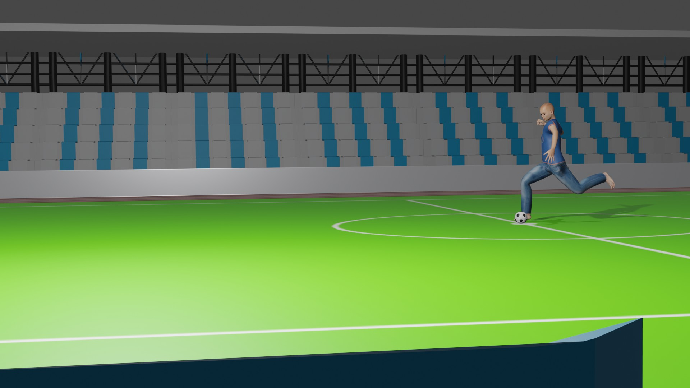
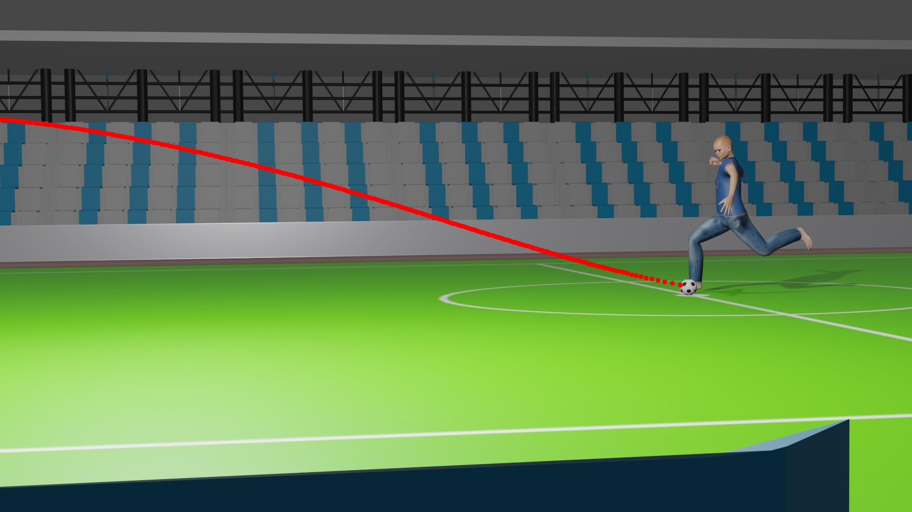
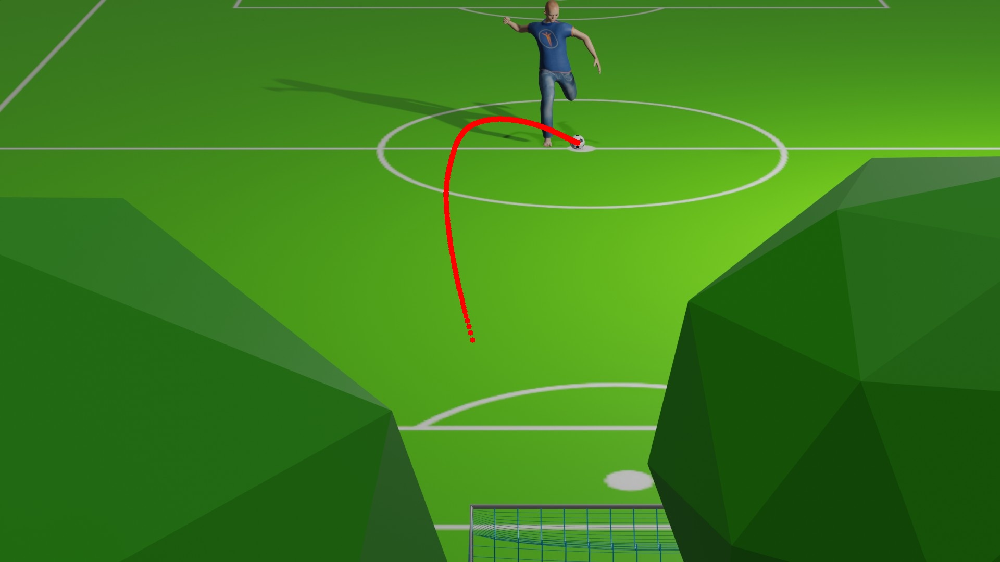

# Homework 1 — Drawing a 3D Trajectory onto Camera Images

**Computer Vision and Applications (CI5336701) — NTUST, 2024 Spring** · David Medina Rosner · F11115117
[Assignment sheet](Homework%231.pdf) · [Solution notebook](homework_1_F11115117.ipynb)

---

## The task

Given **384 3D points** tracing a football's flight ([`3D_Trajectory.xyz`](3D_Trajectory.xyz)), **two 1920×1080 photos** of the same virtual stadium, and the **exact parameters of both cameras** ([`CameraParameter.txt`](CameraParameter.txt)) — compute where each 3D point falls inside each photo, and draw that path onto it.

| Camera 1 — pitch-side, 3.3 m high | Camera 2 — aerial, 27.3 m high |
|---|---|
|  |  |

The two views share one 3D world and nothing else — which is what makes the result checkable.

---

## The theory — `x = K[R|T]X`

A photo has already thrown away depth, but the *forward* direction still works: knowing a point's 3D position and everything about the camera tells you exactly which pixel it landed on.

- **Homogeneous coordinates.** Write `(X, Y, Z)` as `(X, Y, Z, 1)`. No 3×3 matrix can *add* a constant, so translation is impossible as a plain multiply; the appended `1` lets a single matrix both rotate and move a point.
- **`[R|T]` — extrinsics (3×4).** Rotation glued to translation. Converts **world** coordinates into **camera** coordinates, whose origin sits at the lens. Describes where the camera *stands*.
- **`K` — intrinsics (3×3).** Focal length `fx, fy` in pixels (bigger = more zoomed in) plus the principal point `cx, cy` = (960, 540), the image centre. Converts camera coordinates into **pixels**. Describes the *lens*.
- **Perspective divide.** `K[R|T]X` gives `(x, y, w)` — not yet a pixel. The pixel is `u = x/w`, `v = y/w`, where `w` is the point's depth. Dividing by depth is what makes distant things small; this one non-linear step *is* perspective.

| | `fx = fy` | Horizontal FOV | Position |
|---|---|---|---|
| Camera 1 | 2666.67 px | 39.6° | eye level beside the pitch, ~2° down |
| Camera 2 | 4266.67 px | 25.4° | 27.3 m up in the stand, ~17° down |

---

## The implementation

The [notebook](homework_1_F11115117.ipynb) parses `CameraParameter.txt` into four NumPy matrices, loads the trajectory with `np.loadtxt`, appends a column of ones (`np.hstack`) to make the points homogeneous, then for each point:

```python
x_2d = cam1_K @ cam1_RT @ x     # project: (3×3)·(3×4)·(4×1) → (3×1)
x_2d = x_2d[0:2] / x_2d[2]      # perspective divide
cv.circle(img_1, (int(x_2d[0][0]), int(x_2d[1][0])), 5, (255, 0, 0), -1)
```

One catch worth knowing: **OpenCV works in BGR, not RGB.** The image is converted to RGB on load and back to BGR before `cv.imwrite` — skip that and the red trajectory saves out blue.

```bash
pip install numpy opencv-python matplotlib   # then run all cells from inside Homework_1/
```

---

## The result

| [`F11115117_1.jpg`](F11115117_1.jpg) | [`F11115117_2.jpg`](F11115117_2.jpg) |
|---|---|
|  |  |

The same curving free kick — ~48 m down the pitch, peaking ~7.7 m high — reads as a long diagonal from the sideline and a tight hook from above.

**The ball verifies it.** The first trajectory point projects to (1432.7, 601.5) in photo 1 and (1109.3, 273.3) in photo 2 — landing on the ball at the player's foot in *both*. Two unrelated viewpoints could not agree by accident; a wrong matrix order or a skipped perspective divide would break it instantly.

In camera 1, 152 of the 384 points project outside the frame (down to `u ≈ −850`). That is correct, not a bug — the ball genuinely flies out of that narrower view, and OpenCV clips the off-canvas circles silently. Camera 2 keeps all 384.

### Requirements

**Fulfilled** — reads both images and the `.xyz` file ✅ · performs `x = K[R|T]X` with the perspective divide ✅ · draws the projected points ✅ · saves as `F11115117_1.jpg` / `F11115117_2.jpg` ✅ · commented Python source ✅ · `.exe` and report not applicable.

---

## Repository layout

```
Computer_Vision/
└── Homework_1/
    ├── README.md              detailed write-up (you are here)
    ├── homework_1_F11115117.ipynb   solution notebook
    ├── Homework#1.pdf         original assignment sheet
    ├── 3D_Trajectory.xyz      384 input 3D points
    ├── CameraParameter.txt    K and [R|T] for both cameras
    ├── SceneFromCamera1.jpg   input photo 1
    ├── SceneFromCamera2.jpg   input photo 2
    ├── F11115117_1.jpg        result 1
    └── F11115117_2.jpg        result 2
```
