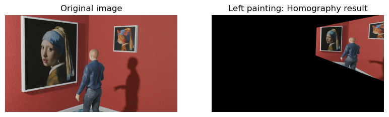
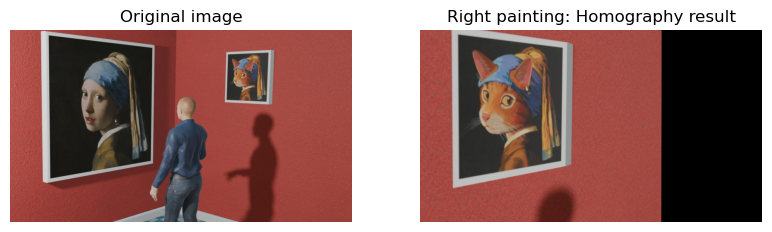

# Homework 2 — Swapping Two Photo Frames with a Homography

**Computer Vision and Applications (CI5336701) — NTUST, 2024 Spring** · David Medina Rosner · F11115117
[Assignment sheet](Homework.pdf) · [Solution notebook](homework_2_F11115117.ipynb)

---

## The task

Given one 1920×1080 photo of a gallery ([`Swap_ArtGallery.jpg`](Swap_ArtGallery.jpg)) holding **two picture frames at very different angles and sizes** — one large, close and turned away from the camera, the other small, distant and nearly frontal — estimate the **3×3 homography** between them from four hand-picked corner pairs and **swap the paintings**, so each hangs in the other's frame with the correct new perspective. A transform that only scales and translates cannot connect those two frames; that is why the problem needs a homography.

---

## The theory — `x' = Hx`

Homework 1 went from 3D to 2D with `x = K[R|T]X`. Here everything is already 2D, but a new fact is in play: **both paintings are flat**, and any two views of the same plane are related by a single invertible 3×3 matrix — a **homography**. Depth and 3D structure drop out, and one matrix describes the whole region, not just the four points used to find it. It is the most general transform that still maps straight lines to straight lines: unlike an affine transform (6 DOF), it does *not* preserve parallelism — exactly what is wanted, since the left frame's edges converge as they recede from the camera.

**Why 8 DOF, not 9.** `H` looks like 9 unknowns, but it acts on **homogeneous coordinates**, where a point is defined only up to scale: `Hx` and `(λH)x` give the same pixel after the perspective divide, so `H` and `2H` are the same transform. That redundancy is removed by fixing **`h₃₃ = 1`**.

**The DLT.** The mapping `x' = (h₁₁x + h₁₂y + h₁₃) / (h₃₁x + h₃₂y + 1)` is non-linear — the unknowns sit in the denominator. Multiplying through by it and collecting terms makes it linear, giving **two rows per point pair**, so 8 unknowns need exactly **4 pairs** — the minimum the assignment asks for. And since `H` is invertible, the reverse swap is free: `H⁻¹` maps the right frame back onto the left.

```
h₁₁x + h₁₂y + h₁₃ − h₃₁(x'x) − h₃₂(x'y) = x'
h₂₁x + h₂₂y + h₂₃ − h₃₁(y'x) − h₃₂(y'y) = y'
```

---

## The implementation

Corners are read off an image viewer and typed in by hand (no mouse interface required), **listed in the same rotational order in both arrays** — a swapped entry still solves cleanly but warps the content into a bow-tie, with no error to warn you.

```python
left_painting  = np.array([[218, 35], [227, 835], [789, 736], [797, 107]])
right_painting = np.array([[1225, 143], [1218, 395], [1438, 405], [1449, 133]])
for left, right in zip(left_painting, right_painting):      # build the 8×8 system
    x, y = left;  x_, y_ = right
    matrix_x.append([x, y, 1, 0, 0, 0, -x_*x, -x_*y])       # the x' row
    matrix_x.append([0, 0, 0, x, y, 1, -y_*x, -y_*y])       # the y' row
matrix_h = np.linalg.inv(matrix_x) @ right_painting.reshape(-1)
matrix_h = np.concatenate([matrix_h, [1]]).reshape(3, 3)    # re-attach h₃₃ = 1
```

With exactly four points the system is square, so the solution is unique and the residual zero — pushing the source corners back through `H` reproduces the destination corners exactly. The bottom row is the interesting part: an affine transform would have `[0, 0, 1]`, and the tiny non-zero `h₃₁ = −4.28e−4`, `h₃₂ = −1.68e−5` are what produce perspective, making the scale `w = h₃₁x + h₃₂y + 1` vary across the quad (0.906 at one corner, 0.650 at another) so different parts of the painting shrink by different amounts and the receding edge converges. `cv.warpPerspective` then applies `H` to **every pixel of the photo**, not just the frame, so most of the output lands off-canvas:

| Left painting warped by `H` | Right painting warped by `H⁻¹` |
|---|---|
|  |  |

Only the pixels inside the destination quad are wanted, so the notebook composites with **bitwise stencils**, which works because `X OR 255 = 255` (white erases) and `X AND 255 = X` (white passes through): fill the destination quad in the original with white, OR the warped image with a white canvas that has a black hole in that same quad so only its content survives, then AND the two — each image is white exactly where the other supplies pixels. Two gotchas: the variables named `black` and `white` hold each other's values, and `cv.fillConvexPoly` edits **in place**, which the notebook relies on to chain the second swap onto the first. Finally, as in Homework 1, the image is converted back to BGR before `cv.imwrite` — skip that and red and blue come out exchanged. Run with `pip install numpy opencv-python matplotlib`, then execute all cells from inside `Homework_2/`.

---

## The result

| Before | After — [`F11115117.jpg`](F11115117.jpg) |
|---|---|
|  |  |

Both paintings changed frames and, crucially, **changed shape to match**: the cat now leans away from the camera with the large frame's perspective, and the Girl with a Pearl Earring is compressed into the small frontal one — while the wall, the visitor and his shadow stay untouched. The left quad covers **407,629 px²** against the right one's **58,164 px²**, a **7.0× area ratio**: shrinking the large painting down discards information and looks fine, but enlarging the small one asks interpolation to invent seven pixels for every one it has, so the blown-up cat is visibly soft — a limit of the source data, not of the homography. Two other honest limits: four points make the system exactly determined, so a mis-read corner is absorbed silently into `H` with no residual to reveal it (more points solved by SVD least squares, or `cv.findHomography` with RANSAC, would average the noise out), and `fillConvexPoly` draws without anti-aliasing, so the seams are hard pixel edges.

**Requirements fulfilled** — homography matrix computed from point sets ✅ · both frame regions defined ✅ · contents swapped ✅ · saved as `F11115117.jpg` ✅ · commented Python source ✅ · `.exe` optional, not applicable.

---

## Repository layout

```
Homework_2/
├── README.md                            detailed write-up (you are here)
├── homework_2_F11115117.ipynb           solution notebook
├── Homework.pdf                         original assignment sheet
├── Swap_ArtGallery.jpg                  input photo (1920×1080)
├── F11115117.jpg                        result — both frames swapped
├── left_painting_homography_result.png  intermediate: left frame warped by H
├── right_painting_homography_result.png intermediate: right frame warped by H⁻¹
└── original_vs_homography_result.png    final before/after comparison
```
