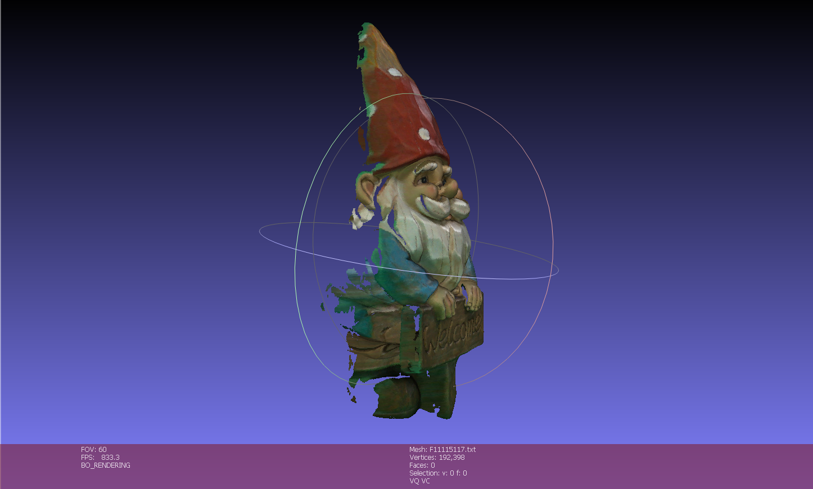

# Homework 3 — Casting Photo Colour onto a 3D Model

**Computer Vision and Applications (CI5336701) — NTUST, 2024 Spring** · David Medina Rosner · F11115117
[Assignment sheet](Homework.pdf) · [Solution notebook](homework_3_david_medina.ipynb)


---

## The task

Given a 2747×1835 photo of a garden gnome ([`Santa.jpg`](Santa.jpg)) and a **381,613-vertex** scan of the same object ([`Santa.xyz`](Santa.xyz), one row per vertex as `x y z nx ny nz`), recover the **3×4 projection matrix `P`** from hand-picked 2D↔3D correspondences, re-project *every* vertex to find which pixel it landed on, and write the model back out as a coloured point cloud (`x y z nx ny nz r g b a`) that MeshLab can open. Vertices facing away from the camera must be **rejected** rather than painted. The 16 correspondences below are picked by hand — pixel coordinates read off an image viewer, 3D coordinates off MeshLab's vertex-picking mode.


---

## The theory — `x = PX`

Homework 1 *used* a known `K[R|T]` to project points; this assignment **solves for it**. Collapsing intrinsics and extrinsics into one matrix `P = K[R|T]` gives a single 3×4 map from homogeneous world points to homogeneous pixels — the same pipeline, with the calibration now unknown. `P` has 12 entries but only **11 degrees of freedom**: as in Homework 2, homogeneous coordinates are scale-invariant, so `P` and `2P` are the same camera. Each correspondence contributes **two rows** to a DLT system, so 6 pairs would suffice in principle; the assignment asks for at least 8, and **16** are used here.

**Why SVD instead of a matrix inverse.** Homework 2 fixed `h₃₃ = 1` and solved a square `Ax = b`. Here the system is left **homogeneous** — `Ap = 0` — which has the useless trivial solution `p = 0` and no inverse to take. The fix is to look for the unit vector minimising `‖Ap‖`, and that is exactly the **right-singular vector of `A` with the smallest singular value**: the last column of `V` in `A = USVᵀ`. With 16 pairs the system is **over-determined** (32 equations, 11 unknowns), so this is a true least-squares fit that averages out hand-picking noise — unlike Homework 2's exact, zero-residual solve.

**Back-face culling.** Re-projection is blind: a vertex on the gnome's back projects to a perfectly valid pixel on his front and would be painted with it. The normals stored in the `.xyz` file are what separate the two — a vertex should be kept only if its normal points *towards* the camera.

---

## The implementation

The DLT rows below are the 3D analogue of Homework 2's: multiply out `u = (p₁₁x + p₁₂y + p₁₃z + p₁₄)/(p₃₁x + p₃₂y + p₃₃z + p₃₄)`, collect terms, and each pair yields one `u` row and one `v` row.

```python
def calculate_matrix_P(points_3d, points_2d):
    p = []
    for (x, y, z), (u, v) in zip(points_3d, points_2d):
        p.append([x, y, z, 1, 0, 0, 0, 0, -u*x, -u*y, -u*z, -u])   # the u row
        p.append([0, 0, 0, 0, x, y, z, 1, -v*x, -v*y, -v*z, -v])   # the v row
    u, s, v = np.linalg.svd(np.array(p))       # solve Ap = 0 in the least-squares sense
    v = np.transpose(v)
    p = [v[0:4, 11], v[4:8, 11], v[8:12, 11]]  # last column of V -> smallest singular value
    return p / p[2][3]                         # normalise so p₃₄ = 1
```

Every one of the 381,613 vertices then gets a `1` appended, is multiplied by `P`, and is divided by its third component — the same perspective divide as Homework 1. The resulting pixel indexes the photo as `img[y][x]` (row first, column second) to read its colour. Finally the original `.xyz` lines are re-written with that RGB appended, guarded by `if normal_y[idx] >= 0:` so the hidden half is skipped.

**Why testing `ny` alone is legitimate here.** The proper visibility test is `n · (C − X) > 0`, where `C` is the camera centre — recoverable as the null vector of `P`. Doing that decomposition puts the camera at **(1.6, 137.4, 58.1)**, a unit direction of **(0.01, 0.92, 0.39)** from the model origin: almost pure `+y`. So the y-component of the normal is a cheap, well-justified stand-in for the full dot product on this particular shot.

---

## The result

| Front — the camera's own viewpoint | Rotated left | Rotated right |
|---|---|---|
|  |  |  |

**From the front it is seamless** — the red hat, the white beard, the blue sleeves and the lettering on the "Welcome" sign all land on the right geometry, and the point cloud reads as a photograph wrapped onto a solid. That is the payoff of a good `P`: the 16 calibration points re-project with an **RMS error of 14.0 px** (worst case 38 px) on a 2747-px-wide image, about 0.5% of the width — the scale of the hand-picking error itself. A non-zero residual is the expected and *useful* signature of an over-determined fit; Homework 2's square system could not have reported one.

**Rotate it, and the method shows its seams** — which is exactly why the side views are worth including. Three artefacts are visible. *Green streaks* on the hat and shoulders: those vertices sit on the silhouette, so their projected pixel falls a hair outside the gnome and samples the studio backdrop. *Ragged holes* down the left flank: vertices culled by the `ny >= 0` test, correctly, because nothing in a single photo can say what colour the back is. *Smeared, stretched colour* on surfaces turning away from the lens: at grazing angles hundreds of vertices compete for the same few pixels, so one pixel's colour is copied across a wide band of geometry.

MeshLab's status bar confirms the count independently: **192,398 vertices** of the original 381,613 survive culling — almost exactly half, as expected for a closed surface photographed from one side. The deliverable is [`F11115117.txt`](F11115117.txt) (13.8 MB), opened with point format `X Y Z Nx Ny Nz R G B`, space separator and `[0-255]` colour range.

**One limitation the renders do not show.** Normals detect *orientation*, not *occlusion*: a vertex on the shoulder can face the camera and still be hidden behind the beard, and it will be painted with whatever stood in front of it. Catching that needs a depth buffer. Colour is also sampled by truncating to an integer pixel, with no bounds check and no bilinear interpolation.

**Requirements fulfilled** — commented Python source ✅ · ≥8 correspondences (16 used) and `P` computed by DLT + SVD ✅ · all vertices re-projected and coloured ✅ · back-facing points rejected via normals ✅ · point cloud saved as `F11115117.txt` in `x y z nx ny nz r g b a` ✅ · snapshot of the picked points ✅ · `.exe` optional, not applicable.

---

## Repository layout

```
Homework_3/
├── README.md                          detailed write-up (you are here)
├── homework_3_david_medina.ipynb      solution notebook
├── Homework.pdf                       original assignment sheet
├── Santa.jpg                          input photo (2747×1835)
├── Santa.xyz                          input scan — 381,613 vertices + normals
├── reference_points.png               the 16 picked correspondences, labelled
├── FinalResult_{front,left,right}.png MeshLab renders of the coloured cloud
└── F11115117.txt                      result — coloured point cloud for MeshLab
```
