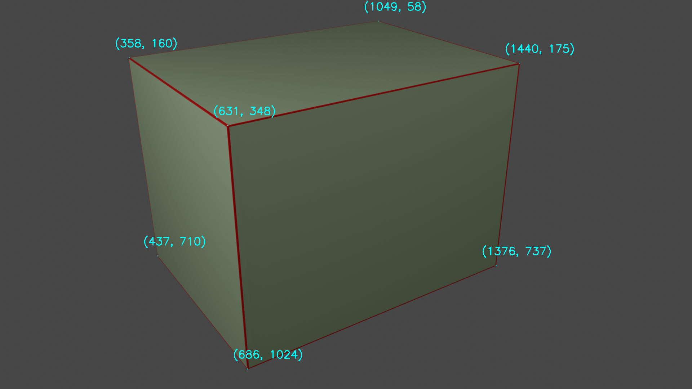

# Homework 4 — Calibrating a Camera from a Single Image

**Computer Vision and Applications (CI5336701) — NTUST, 2024 Spring** · David Medina Rosner · F11115117
[Assignment sheet](Homework_4_v1.pdf) · [Solution notebook](homework_4_david_medina.ipynb)

---

## The task

One 1920×1080 render ([`imgToCalib.png`](imgToCalib.png)) of a single box measuring **8 × 6 × 6 m**, with the world origin on a corner and the axes along its edges. No lens distortion, no feature detection, no 3D point list — the *only* extra knowledge is the box's real dimensions. From that, recover the **intrinsic matrix `K`**, the **extrinsic matrix `[R|t]`**, and **how far the camera stands from the origin**. The three visible faces are picked by hand as rectangles of known real size: 8×6 on top, 8×6 on the right, 6×6 on the left.



---

## The theory — Zhang's method and the IAC

Homework 3 recovered a projection matrix from 3D↔2D point pairs. Here **no 3D coordinates are given at all**, so a different lever is needed: each face is a *plane of known shape*, and a plane maps to the image by a homography (Homework 2). Picking three faces gives three homographies from real metres to pixels.

**The constraint that makes it work.** For a plane, that homography factorises as `H = λK[r₁ r₂ t]`, where `r₁` and `r₂` are the first two columns of a **rotation** matrix. Rotation columns are orthonormal, which hands over two facts for free — `r₁ · r₂ = 0` (perpendicular) and `‖r₁‖ = ‖r₂‖` (equal length). Since `r₁ = λ⁻¹K⁻¹h₁` and `r₂ = λ⁻¹K⁻¹h₂`, both are really statements about `K` alone.

Writing `ω = K⁻ᵀK⁻¹` — the **Image of the Absolute Conic** — turns them *linear*: `h₁ᵀωh₂ = 0` and `h₁ᵀωh₁ = h₂ᵀωh₂`. That is the whole trick. `ω` is symmetric, so it holds only **6 unknowns**, and each plane contributes **2 equations** — hence the assignment's "select 3 rectangles". Six equations, six unknowns, solved as a homogeneous system `Aω = 0` by **SVD**, exactly as in Homework 3: the right-singular vector with the smallest singular value. Then `ω⁻¹ = KKᵀ` is symmetric positive-definite and `K` is upper-triangular, so pulling `K` back out is a **Cholesky decomposition**, written here as closed-form back-substitution.

**Then the pose.** With `K` known, one homography yields the rest: `λ = ‖K⁻¹h₁‖`, then `r₁ = K⁻¹h₁/λ`, `r₃ = r₁ × r₂`, and `t = K⁻¹h₃/λ`. Noisy picks never give an exactly orthonormal pair, so `r₂` is **re-derived as `r₃ × r₁`** to force a valid rotation. Finally the camera's world position is `C = −Rᵀt`, because the camera centre is the point where `RX + t = 0`.

---

## The implementation

Each face's homography comes from `cv.findHomography`, mapping real dimensions to picked pixels; the two IAC constraints per plane become six rows of `A`. From there it is SVD, a re-pack, and the Cholesky back-substitution:

```python
u, s, v = np.linalg.svd(A)                    # solve Aw = 0
v = np.transpose(v)
w = np.array([[v[0,5], v[1,5], v[2,5]],       # re-pack the 6 values
              [v[1,5], v[3,5], v[4,5]],       # as a symmetric 3x3 conic
              [v[2,5], v[4,5], v[5,5]]])
inv_w = np.linalg.inv(w); inv_w = inv_w / inv_w[2,2]   # = KK^T, normalised
c = inv_w[0,2]; e = inv_w[1,2]                         # Cholesky, written out
d = sqrt(inv_w[1,1] - e**2)
b = (inv_w[0,1] - c*e) / d
a = sqrt(inv_w[0,0] - b**2 - c**2)
K = np.array([[a, b, c], [0, d, e], [0, 0, 1]])
```

One subtlety: the homography used for the pose is the **top face**, whose plane origin sits 6 m up at `z = 6`. Multiplying `[R|t]` by a translation of `−6` in `z` slides the result down to the world origin on the box's base corner, so the reported pose is in the frame the assignment asks for.

---

## The result

The intrinsics are the graded 75%, and they land:

| | computed | ground truth | error |
|---|---|---|---|
| `fx` | 1868.88 | 1866.7 | **+0.12%** |
| `fy` | 1865.82 | 1866.7 | **−0.05%** |
| `cx` | 953.46 | 960.0 | −6.5 px |
| `cy` | 535.50 | 540.0 | −4.5 px |
| skew | −11.21 | 0 | — |

Both focal lengths are within a tenth of a percent, and the principal point within 7 px of the image centre on a 1920-px-wide frame. The skew that should be exactly zero comes out at −11.2 — small against `fx ≈ 1869`, and a fair measure of the hand-picking noise, since nothing in the method forces it to vanish.

**The rotation is essentially exact; the distance is not.** Every entry of `R` matches the ground truth to within **0.0021**, and the recovered camera *direction* is **0.09° off** — a thousandth of a right angle. But the computed position `(12.92, 17.42, 10.59)` sits **24.13 m** from the origin against a true `(6.00, 8.10, 4.94)` at **11.23 m**: a constant factor of **2.15** too far. Direction right, magnitude wrong, is the signature of a pure **scale** error — and in Zhang's method scale enters at exactly one place, `λ = ‖K⁻¹h₁‖`, which is fixed by the real edge lengths assigned to the picked rectangle. Re-running the pose with the ground-truth `K` substituted for the estimated one moves the dominant translation component by **less than 0.1%**, so neither the intrinsics nor the SVD is the culprit; the scale is set by the homography, i.e. by the corner picks and the metric labels put on that one face.

**Requirements fulfilled** — commented Python source ✅ · prints intrinsic `K` ✅ · prints extrinsic `[R|t]` ✅ · prints the camera's distance from the origin ✅ · `.exe` optional, not applicable.

---

## Repository layout

```
Homework_4/
├── README.md                       detailed write-up (you are here)
├── homework_4_david_medina.ipynb   solution notebook
├── Homework_4_v1.pdf               original assignment sheet (incl. ground truth)
├── imgToCalib.png                  input render (1920×1080)
├── reference_points.png            the seven picked box corners, labelled
└── BlenderFileForReference/        the scene the image was rendered from
```
