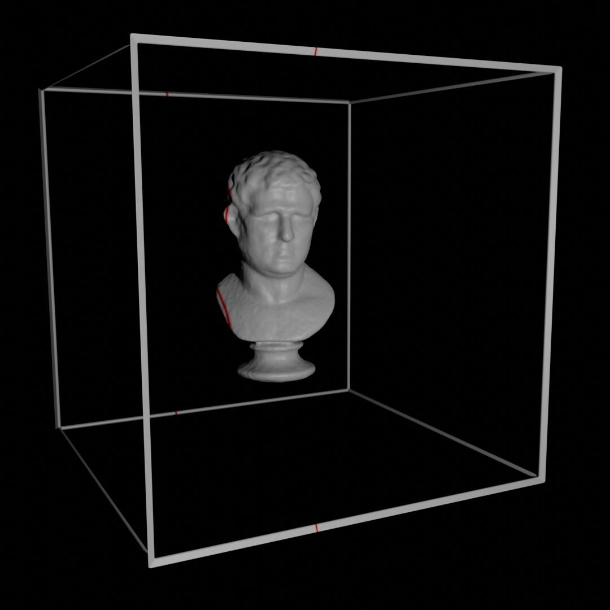
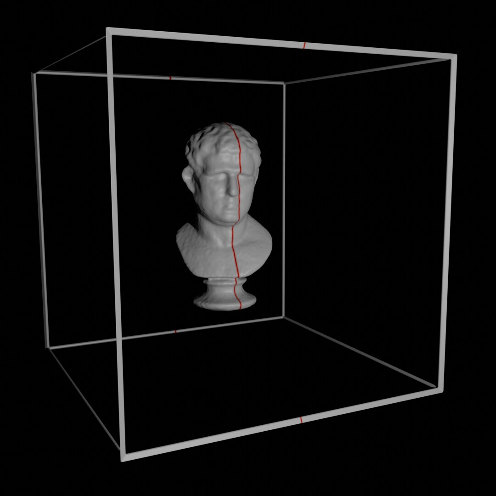
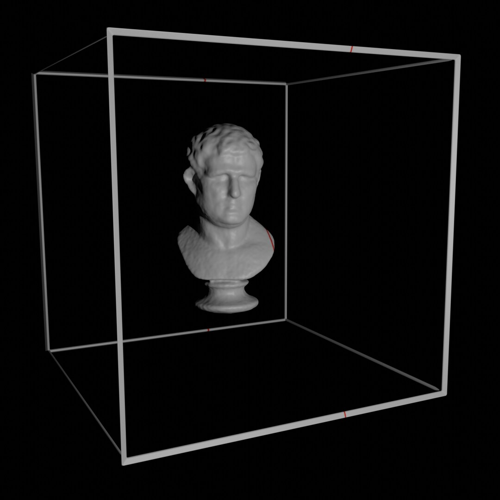
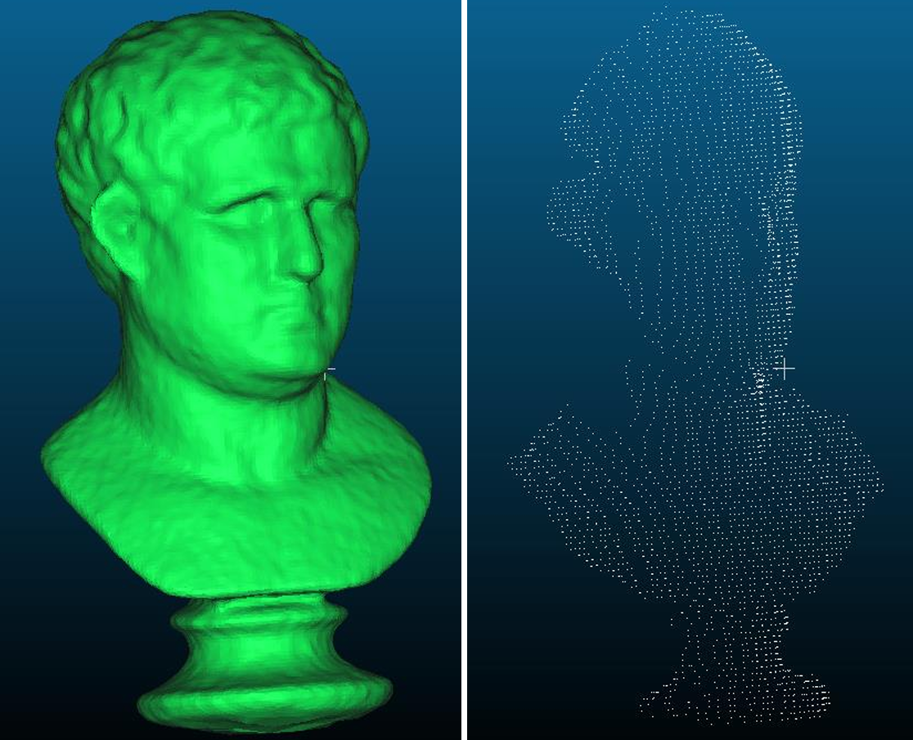
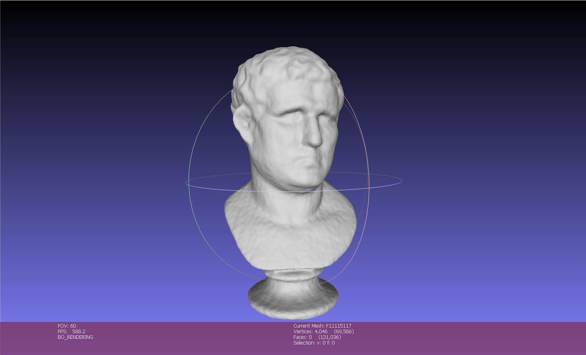
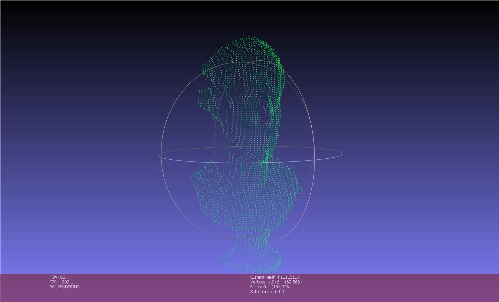
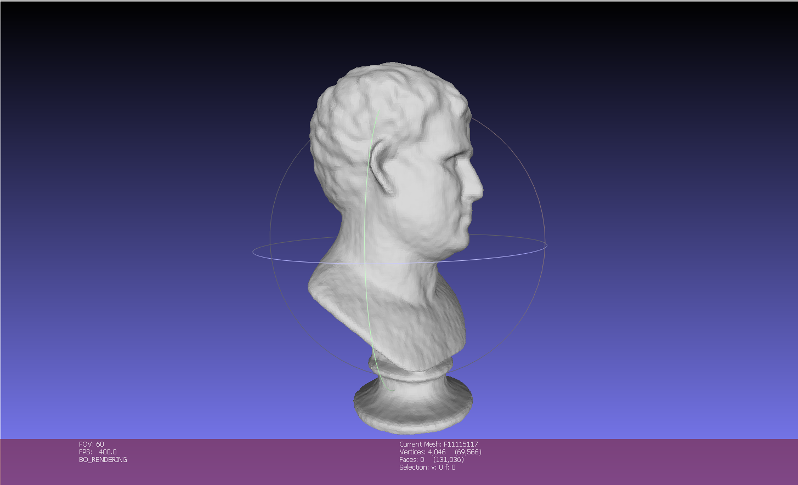
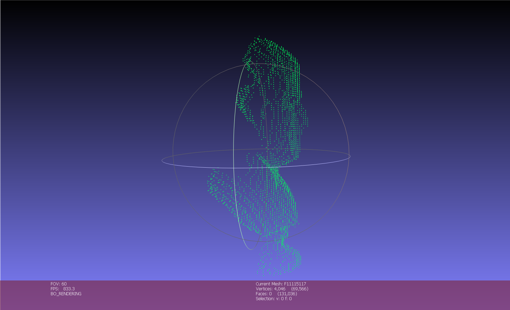

# Midterm Project — 3D Scanning from Cast Shadows

**Computer Vision and Applications (CI5336701) — NTUST, 2024 Spring** · David Medina Rosner · F11115117
[Project brief](MidtermProject.pdf) · [Report](midterm_david_medina.pdf) · [Solution notebook](midterm_david_medina.ipynb)

---

## The task

**55 frames** of 1080×1080 ([`ShadowStrip/`](ShadowStrip)) show a marble bust inside a **200 mm wireframe cube**. A rod held in front of a parallel light casts a thin red shadow plane that sweeps across the scene one step per frame. Recover the bust's 3D shape from that sweep alone and export it as a point cloud, then compare against [`GroundTruth.stl`](GroundTruth.stl) (131,036 triangles). Note the four short red marks where the stripe crosses the cube's bars — they are the whole key.

| Frame 0 — sweep starts left | Frame 27 — crossing the face | Frame 54 — sweep ends right |
|---|---|---|
|  |  |  |

---

## The theory — a known plane is what replaces the second camera

A single photo cannot give depth: every pixel is a ray, and the object could sit anywhere along it. Homework 1 solved that by being *given* the 3D points; here the missing constraint comes from the light. **Every lit point lies on the shadow plane**, so the ray from the camera and the plane meet at exactly one point. One camera plus one known plane is enough — this is **structured-light triangulation**, and the brief cites the *paintbrush laser range scanner* paper it comes from.

**The cube is a calibration target that recalibrates itself every frame.** The plane's pose is unknown and changes with every step of the sweep, but the stripe always crosses four bars of the cube, and those four crossings are the corners of the plane's intersection with a 200 mm square of known size. Four points on a known plane → a **homography** (Homework 2). Warping each frame by it lifts the image straight into *real millimetres on the shadow plane* — so no camera calibration, no `K`, no `[R|t]`, no lens model is ever needed. Each frame carries its own geometry.

**Detecting red by channel difference, not by level.** The scene is greyscale marble under grey light, where `R ≈ G ≈ B`. Thresholding the red channel alone would fire on every bright highlight; thresholding `R − B > 15` fires only where the colour is genuinely *chromatic*. Taking a difference between channels cancels brightness and leaves hue — a general trick worth remembering whenever a coloured marker must be found on a neutral scene.

**Stacking slices into a volume.** Each warped frame gives one planar contour — a cross-section. The sweep advances one step per frame, so the frame index *is* the third coordinate, and the 55 contours stack into a shape.

---

## The implementation

```python
red_px = img[:,:,2] - img[:,:,0]        # red channel minus blue, as float
red_px = (red_px > 15).astype(np.uint8) * 255
```

Finding the four wireframe crossings is a **run-length scan down the rows**. Summing the binary image along each row gives a per-row "has red?" flag; every transition in that flag marks where a chunk of red begins or ends. The first four transitions belong to the two upper bars, the last four to the two lower bars, and scanning those rows left-to-right gives the matching column. Those four points then map to the corners of a 200×200 output:

```python
destination_pt = np.array([[200, 0], [0, 0], [0, 200], [200, 200]])
h_matrix, _ = cv.findHomography(source, destination)
result = cv.warpPerspective(image, h_matrix, (200, 200))
```

After warping, each row of the 200×200 image should hold one profile point, so `np.argmax` picks the first brightest pixel per row, and a 5-px border mask deletes the wireframe marks themselves. Converting to world coordinates is then pure bookkeeping, flipping the image axes to match the brief's figure — `z = 100 − row`, `y = 100 − col`, `x = frame index − 28`. That last term is the one real **assumption**: consecutive frames are taken 1 mm apart and the sweep is centred on the object. The brief explicitly allows it ("assign a reasonable Z value... you can do any assumption based on the known conditions").

---

## The result

**4,046 points** across **55 slices** (14 to 121 points per slice, 74 on average), spanning x ∈ [−28, 26], y ∈ [−27, 22], z ∈ [−56, 65] mm — a bust roughly 55 mm deep and 120 mm tall inside the 200 mm frame. Against the ground-truth mesh, CloudCompare reports a mean distance of **1.70 mm** (max 5.17 mm, σ 1.24 mm) — **0.85% of the 200 mm working volume**, from nothing but shadow edges and a wireframe.



| | ground truth — 131,036 faces | reconstruction — 4,046 points |
|---|---|---|
| **Front** |  |  |
| **Side** |  |  |

Front-on, the bust is unmistakable: the brow, the bridge of the nose, the chin and the flare of the pedestal all survive, and the contours crowd together exactly where the surface turns steeply. **The side view is the one that explains the method** — there the 55 slices separate into distinct vertical curtains, making it plain that this is a *stack of plane sections*, not a surface. Every point sits on one of 55 planes 1 mm apart, and nothing was ever measured in between.

**Honest limitations.** `argmax` keeps only the *first* brightest pixel in each row, so where the stripe is visible twice across a concavity — beside the nose, under the chin — the second crossing is silently dropped; those are the gaps down one side of the face in the comparison above. The 5-px border mask is unconditional, so real surface points near the cube's edges go with the wireframe marks. The 1 mm frame spacing is inferred, not measured, and any error in it scales the model along one axis only. And 4,046 points against 131,036 ground-truth triangles is sparse by design: fine detail like the eyes and mouth is only *implied* by how the contours bunch, never resolved.

**Requirements fulfilled** — commented Python source that imports all images and outputs a correctly sized `.xyz` ✅ · 3D point cloud `F11115117.xyz` ✅ · two-page English report with a visual ground-truth comparison ✅ · `.exe` not required for Python.

---

## Repository layout

```
MidtermProject/
├── README.md                     detailed write-up (you are here)
├── midterm_david_medina.ipynb    solution notebook
├── midterm_david_medina.pdf      two-page report, incl. the ground-truth comparison
├── MidtermProject.pdf            original project brief
├── ShadowStrip/                  input — 55 frames of the sweeping shadow plane
├── GroundTruth.stl               reference mesh, 131,036 triangles
├── groundTruth_* / pointCloudResult_*.png   MeshLab renders (front, side, side-by-side)
└── F11115117.xyz                 result — 4,046 reconstructed 3D points
```
