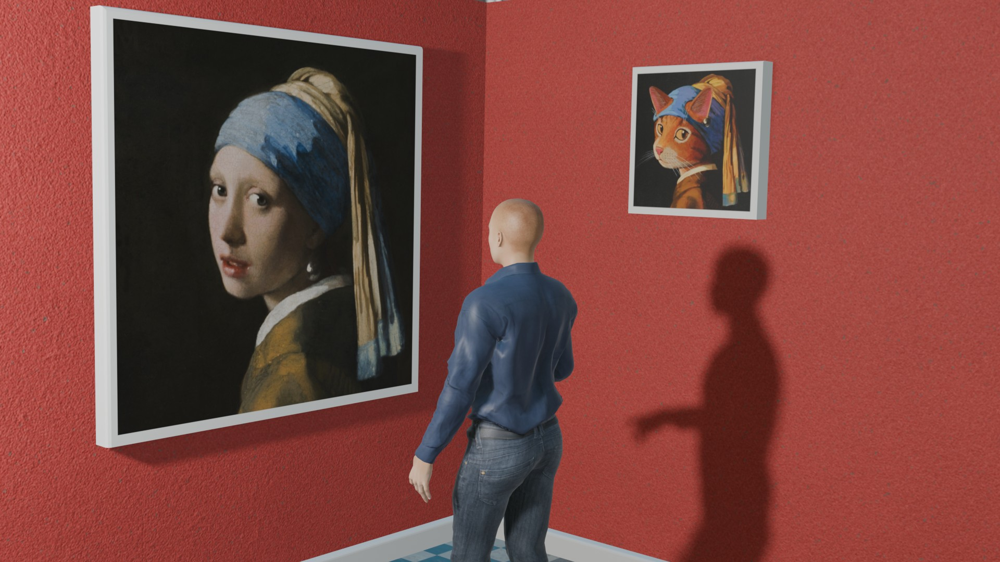
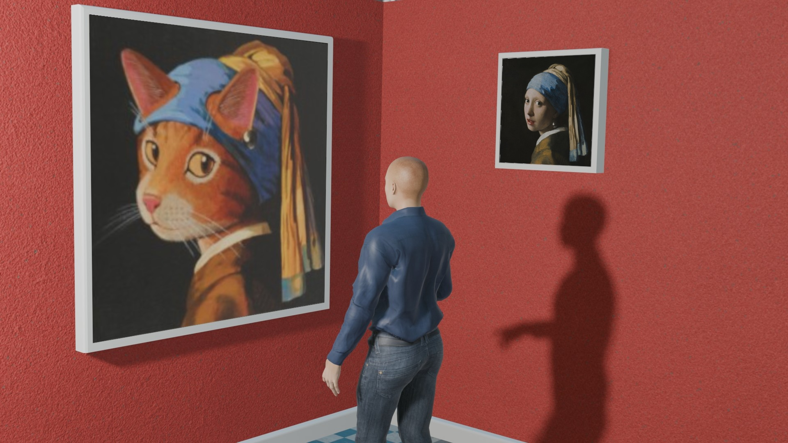
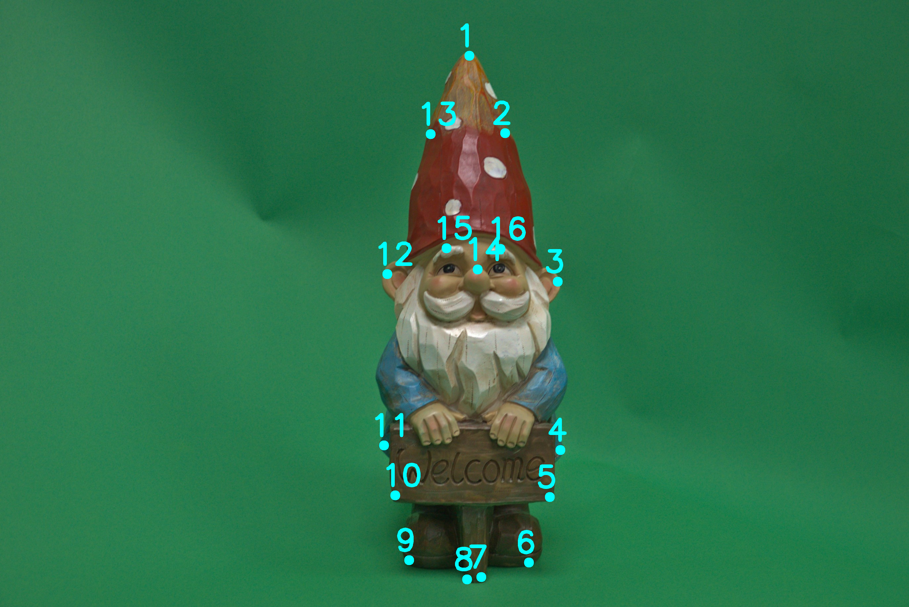
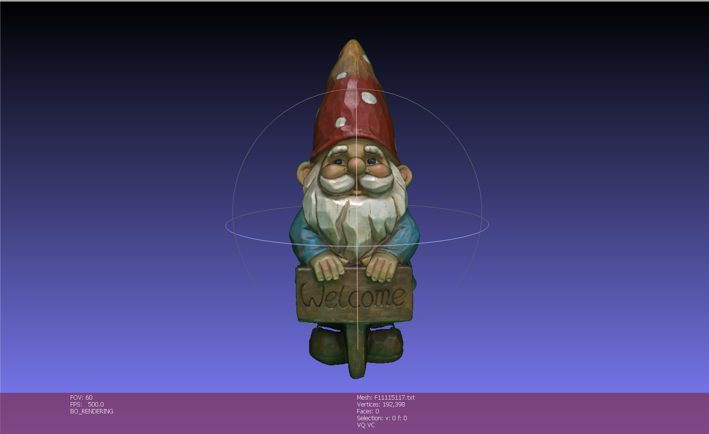
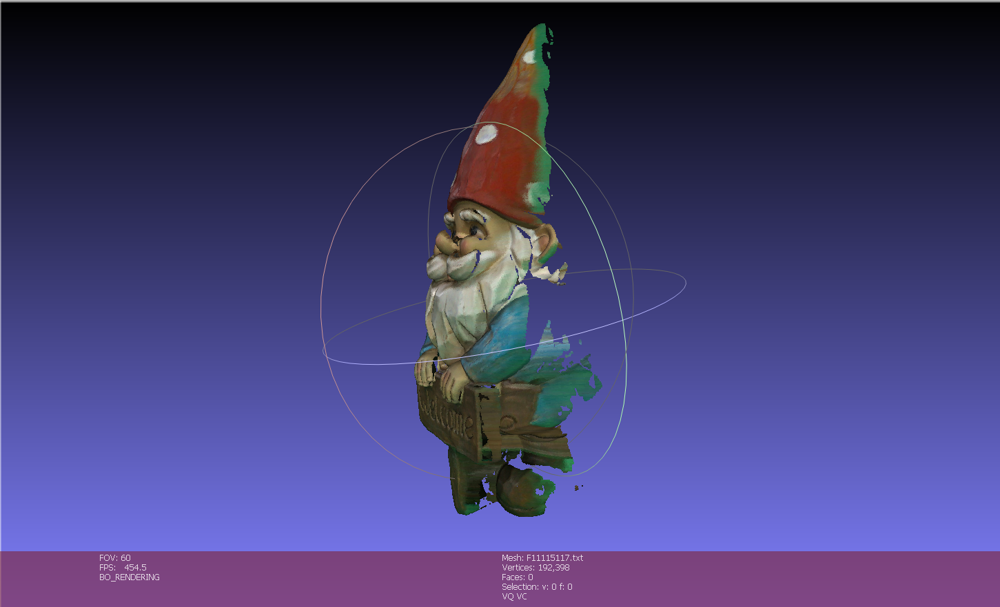

# Computer Vision and Applications — Coursework

Assignments for **Computer Vision and Applications (CI5336701)** at **NTUST**.

---

## Assignments

### [Homework 1 — Drawing a 3D Trajectory onto Camera Images](Homework_1/README.md)

Given the 3D flight path of a football (384 points in world coordinates) and two photographs of the same virtual stadium taken by cameras with known parameters, compute where every 3D point lands in each photo and draw the trajectory onto the images.

This is the **pinhole camera model** put to work — `x = K[R|T]X` — covering homogeneous coordinates, the intrinsic matrix `K` (the lens), the extrinsic matrix `[R|T]` (the camera's position and orientation), and the perspective divide that actually creates the sense of depth. The two cameras are deliberately very different: one stands at eye level beside the pitch with a 39.6° field of view, the other looks down from 27 m up through a narrower 25.4° telephoto lens. The same 3D path therefore appears as a long diagonal in one image and a tight hook in the other.

The result is verified visually: the first trajectory point lands exactly on the ball at the player's foot in **both** images, which two independent viewpoints would never agree on if the maths were wrong.

📄 **[Read the full write-up →](Homework_1/README.md)**

| Camera 1 (pitch-side) | Camera 2 (aerial) |
|---|---|
|  |  |

---

### [Homework 2 — Swapping Two Photo Frames with a Homography](Homework_2/README.md)

Given a single photo of an art gallery holding two picture frames — one large, close and turned away from the camera, the other small, distant and nearly frontal — estimate the projective transform between them from four hand-picked corner pairs and swap the paintings, so each one hangs in the other's frame with the correct new perspective.

Where Homework 1 went from 3D to 2D, this one stays in the image plane and exploits a different fact: **both paintings are flat**. Any two views of the same plane are related by a single 3×3 **homography** — the most general transform that still maps straight lines to straight lines, with **8 degrees of freedom** rather than 9, because homogeneous coordinates are only defined up to scale. The write-up covers the transform hierarchy (translation → Euclidean → similarity → affine → homography), the **Direct Linear Transform** that turns the non-linear mapping into a solvable 8×8 linear system, why four point pairs are exactly enough, and the bitwise-mask compositing trick that drops a warped image into a hand-defined region.

Because a homography is invertible, the same matrix does both halves of the swap: `H` sends the left painting right, and `H⁻¹` sends the right painting left.

📄 **[Read the full write-up →](Homework_2/README.md)**

| Original | Paintings swapped |
|---|---|
|  |  |

---

### [Homework 3 — Casting Photo Colour onto a 3D Model](Homework_3/README.md)

Given a photo of a garden gnome and a 381,613-vertex 3D scan of the same object, recover the camera that took the photo, re-project every vertex of the model into the image to find out what colour it should be, and write the model back out as a coloured point cloud.

This closes the loop on Homework 1. There, the camera matrix `K[R|T]` was **given** and used to project points; here the matrix — now written as a single 3×4 **projection matrix `P`** — is the **unknown**, recovered from 16 hand-picked 2D↔3D correspondences. Because a projection matrix has 11 degrees of freedom and every correspondence supplies two equations, 16 pairs make the system heavily over-determined, so it is solved by **SVD** as a least-squares fit rather than by the exact matrix inverse Homework 2 could use. The write-up covers why the homogeneous system `Ap = 0` needs the smallest singular vector, and how the scan's **vertex normals** are used to reject the half of the model facing away from the camera — otherwise points on the gnome's back would be painted with his face.

📄 **[Read the full write-up →](Homework_3/README.md)**

The 16 calibration points re-project with an RMS error of 14 px on a 2747-px-wide image, and 192,398 of the 381,613 vertices survive back-face culling. From the camera's own viewpoint the result is seamless; rotating it exposes the method's limits — green streaks where silhouette vertices sampled the backdrop, and holes where the culling correctly refused to invent colour for surfaces the photo never saw.

| Input photo + the 16 picked points | Result — front | Result — rotated |
|---|---|---|
|  |  |  |

---

## Tooling

Python, in Jupyter notebooks, using **NumPy** (matrix maths), **OpenCV** (`opencv-python`, for image I/O and drawing) and **Matplotlib** (inline display).

```bash
pip install numpy opencv-python matplotlib
```

Homework 3 additionally uses **MeshLab** as an external tool — to pick 3D vertex coordinates off the scan, and to view the resulting coloured point cloud.
